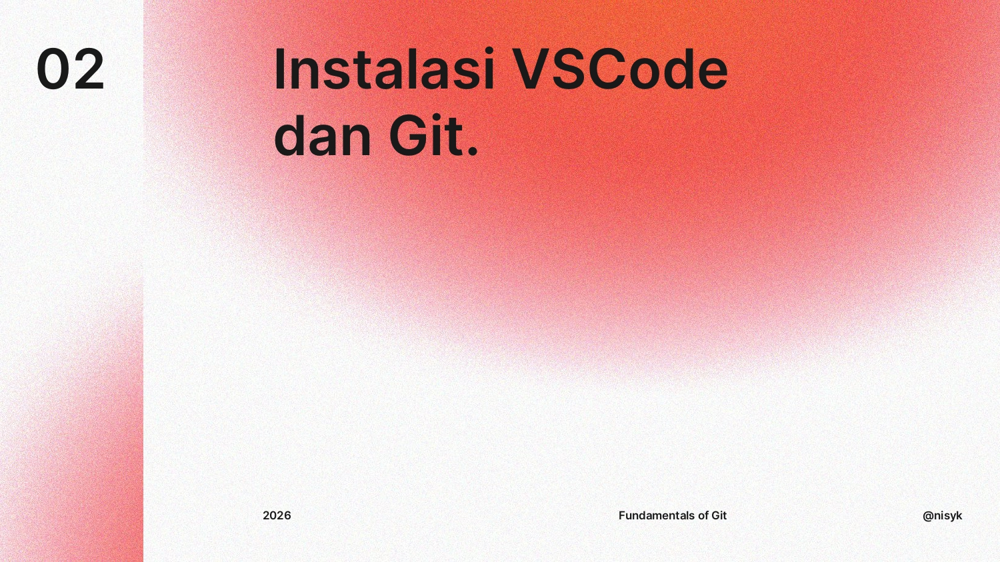
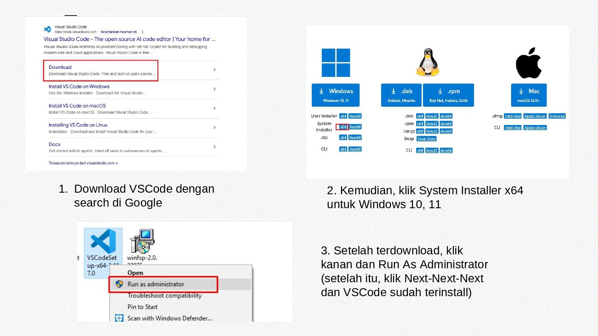
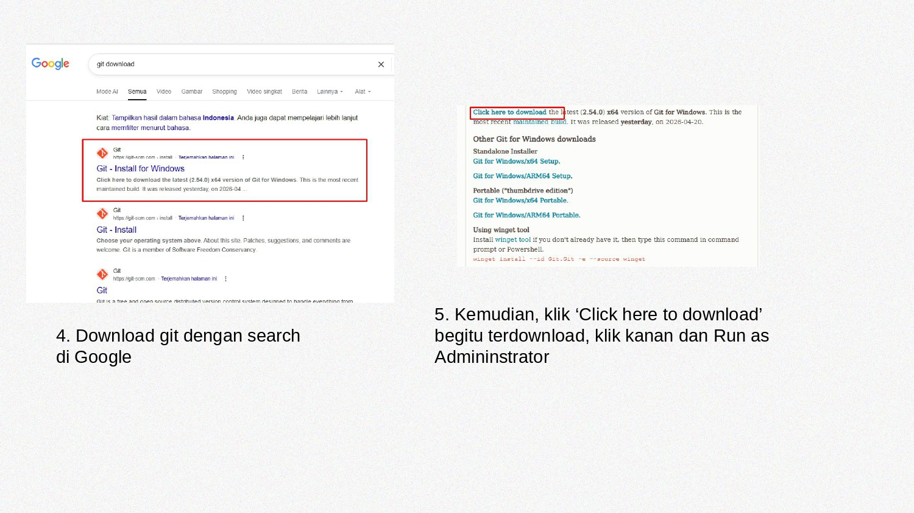
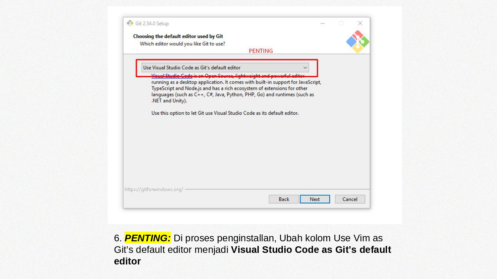

#### < [Fundamental Git](1-fundamental-git.md)

# Instalasi Git 

Untuk menginstall aplikasi yang diperlukan:
- **Git**
- **Visual Studio Code**
Diperlukan step-by-step sebagai berikut *(Untuk Windows)*:





Setelah itu buka **Git Bash** di daftar aplikasi Windows untuk membuka terminal Git.

---

🐧 Untuk Linux, ini akan lebih jauh mudah, buka Terminal, dan ketikkan perintah:
```bash
sudo apt install git                               # Ubuntu/Linux Mint/Debian

sudo dnf install git                               # Fedora

sudo pacman -S git                                 # Arch
```
> ⚙️ Tidak perlu menginstall Visual Studio Code, karena git di Linux sudah didesain modular.

#### > [Perintah UNIX](2-unix-command.md)
