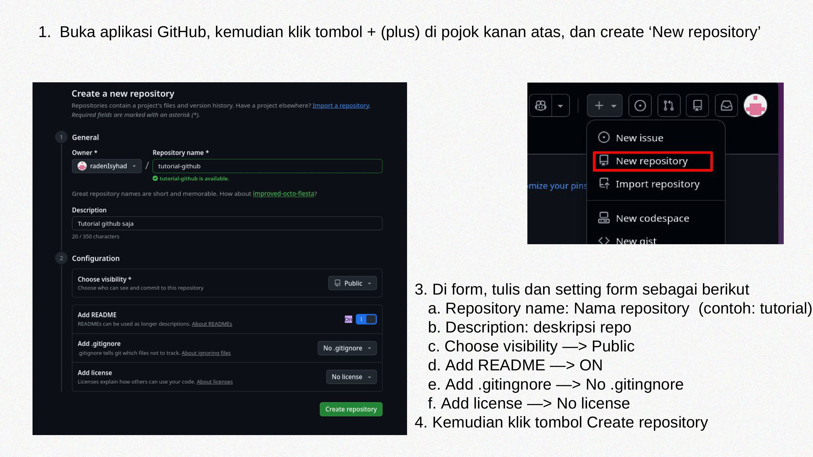
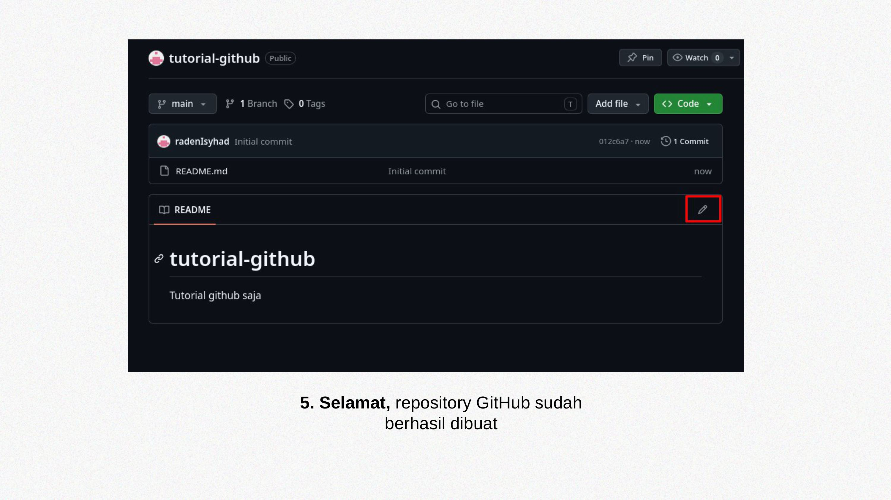

#### < [Perintah Dasar Git](4-git-basic-command.md)

# Membuat dan mendownload repository di GitHub

## Membuat repository 
Diperlukan step-by-step di browser (dengan akun GitHub sudah login) sebagai berikut:


## Mendownload repository
1. Klik tombol hijau yang bertuliskan **Code** di web repo GitHub anda. 
2. Pilih **link/URL** yang tertera pada pop-up, setelah itu klik kanan dan klik copy, atau klik ikon *copy*.  
3. Buka Git Bash atau Terminal (di Linux/macOS)
4. Ketik perintah sebagai berikut:
```bash
git clone <link-repo>

# Sistem akan mendownload repo di directory/folder yang anda operasikan
```

5. Buka file manager dan tuju directory/folder yang anda operasikan untuk melihat repository anda sudah terdownload

> 💡 **Catatan:** Metode ini bisa dilakukan jika ingin mendowload repository orang lain
#### > [Push dan pull repository dari local ke GitHub](6-push-n-pull-repository.md)
