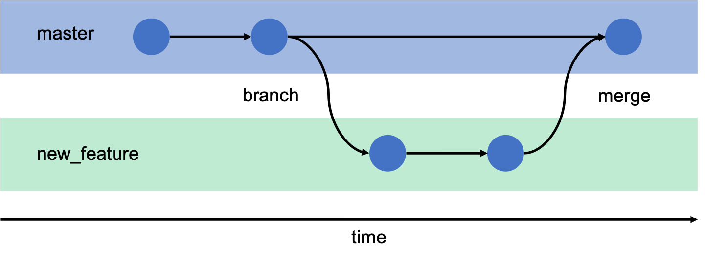
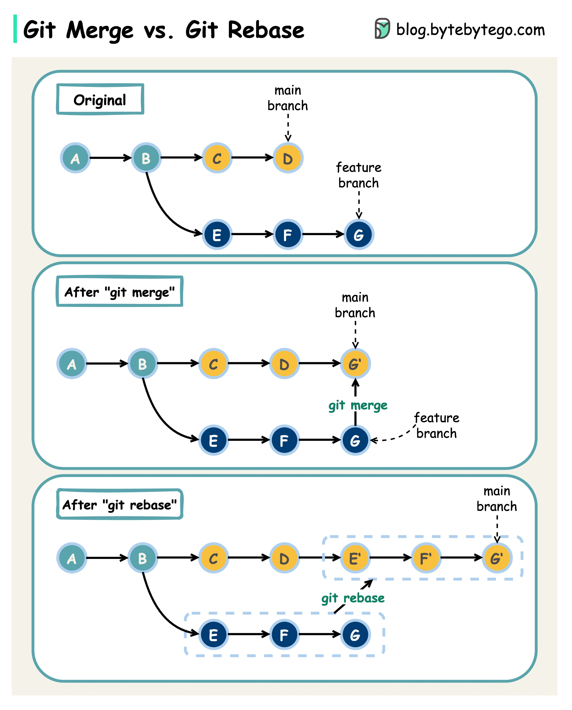

#### < [Push dan pull repository dari local ke GitHub](6-push-n-pull-repository.md)

# Branching dasar
Branching memungkinkan tim pengerjaan proyek berjalan di beberapa jalur berbeda secara bersamaan tanpa mengganggu kode utama (main). Fitur ini sangat krusial untuk eksperimen fitur baru atau perbaikan bug secara terisolasi sebelum akhirnya disatukan kembali. Penguasaan branching dan strategi penggabungan kode merupakan standar tinggi dalam manajemen versi profesional.


-> Gambar 1: Konsep branching dasar

Dalam Git, **Branch** diibaratkan sebagai jalur paralel dari proyek utama. Hal ini memungkinkan pengerjaan fitur baru dilakukan di cabang terpisah sehingga jika terjadi kegagalan, kode utama tetap dalam kondisi stabil dan bisa digunakan.

| **Perintah**           | **Fungsi**                                                | **Lokasi Operasi** |
| ---------------------- | --------------------------------------------------------- | ------------------ |
| `git branch <nama>`    | Membuat cabang (jalur) baru dari posisi saat ini.         | Local Repository   |
| `git checkout <nama>`  | Berpindah dari satu cabang ke cabang lainnya.             | Working Directory  |
| `git merge <nama>`     | Menggabungkan perubahan dari satu cabang ke cabang aktif. | Local Repository   |
| `git branch -d <nama>` | Menghapus cabang yang sudah tidak diperlukan lagi.        | Local Repository   |
### Membuat branch di repository GitHub

Di repository local, lakukan step-by-step sebagai berikut:

**1. Membuat cabang baru**
Membuat branch baru bernama 'fitur-baru'
```bash
git branch fitur-baru
```

**2. Berpindah jalur**
Pindah dari branch utama/`main` ke branch `fitur baru`, agar perubahan-perubahan baru tidak mengganggu branch `main`.
```bash
git checkout fitur-baru
```

**3. Bekerja di jalur tersebut**
Lakukan pekerjaan **`git add`** dan **`git commit`** untuk cabang fitur tersebut *[Klik untuk intruksi selengkapnya](4-git-basic-command.md)*

**4. Kembali ke jalur utama**
Kembali ke branch utama/`main` untuk mempersiapkan penggabungan
```bash
git checkout main
```

**5. Menggabungkan perubahan**
Tarik semua hasil kerja dari branch `fitur-baru` ke branch `main`
```bash
git merge fitur-baru
```

---

### Git Rebase (Penyederhanaan History)

Selain `git merge`, terdapat metode lain untuk menggabungkan perubahan yang disebut dengan **Git Rebase**. Perintah ini sering dianggap sebagai fitur tingkat lanjut yang sangat kuat bagi profesional untuk menjaga history proyek tetap bersih dan rapi.

Berbeda dengan `merge` yang menciptakan satu _commit_ baru sebagai jembatan penggabungan, `rebase` bekerja dengan cara memindahkan seluruh rangkaian _commit_ dari satu cabang ke titik paling akhir di cabang target (biasanya _main_). Hasilnya adalah riwayat proyek yang terlihat lurus dan linear tanpa ada cabang yang bercabang-cabang di dalam log.


-> Gambar 2: Perbedaan antara Merge dan Rebase
git push -u origin main

| `git merge`                                                                                                    | `git rebase`                                                                                                                                                                                                     |
| -------------------------------------------------------------------------------------------------------------- | ---------------------------------------------------------------------------------------------------------------------------------------------------------------------------------------------------------------- |
| Menjaga sejarah apa adanya (terlihat kapan cabang dibuat dan kapan digabungkan). Cocok untuk arsip yang jujur. | "Menulis ulang" sejarah agar terlihat seolah-olah semua pengerjaan dilakukan secara berurutan dalam satu garis lurus. Sangat disukai oleh tim profesional yang mengutamakan kerapihan riwayat (_clean history_). |

> **⚠️ Catatan Penting:** Sangat tidak disarankan melakukan `git rebase` pada branch yang sudah di-push ke server (GitHub/VPS) dan sedang dikerjakan oleh anggota tim lain. Hal ini dikarenakan rebase mengubah *Commit History* yang dapat menyebabkan **conflict** dan **duplicate commit** saat tim lain melakukan `git pull`

#### > [Mengembalikan (Revert) Perubahan di Git](8-revert-changes.md)