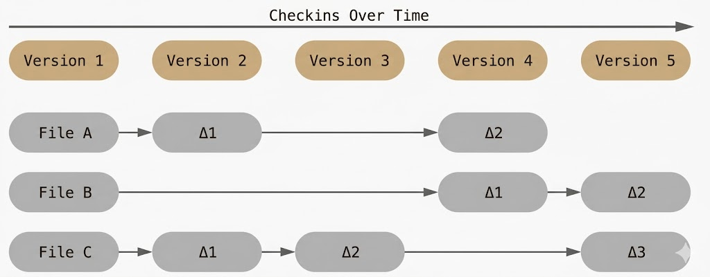
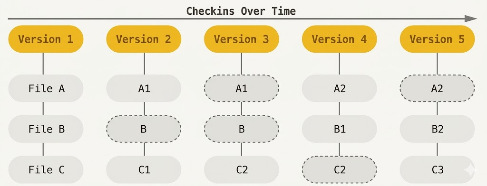
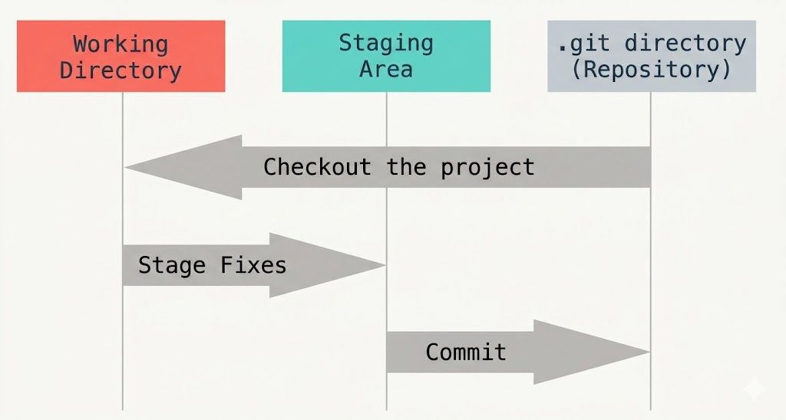

#### < [Pendahuluan](README.md)

# Fundamental Git
Pada dasarnya git adalah sistem kontrol versi, dibandingkan metode tradisional (menggunakan versi file), git bertindak secara sistemik, sehingga dapat menyimpan setiap perubahan file dalam Commit History alih-alih menyimpan dalam setiap versi. 

-> Gambar 1: Sistem Kontrol Versi Tradisional

Karena perubahan file berdasarkan sistem tradisional (seperti menyimpan dalam nama: tugas_akhir_revisi.docx, tugas_akhir_revisi_finallll_fixx_bangettt.docx) menuntut kedisiplinan yang cukup tinggi dibandingkan sistem git, jika 'ceroboh', seperti lupa menyimpan file versi lama, atau tak sengaja menghapus file, maka akan sangat untuk dikembalikan seperti semula.
Maka dari itu, sistem tradisional sudah tidak efisien dalam melakukan kerja yang kompleks dan kolaboratif.

Dengan git, kita menyimpan semua **commit/perubahan** dalam bentuk **snaphots**, yang di mana jika terjadi perubahan yang membuat kita harus rollback/kembali ke versi lama, git udah menyimpan dalam bentuk snapshot (atau sering disebut Commit History).

-> Gambar 2: Sistem Kontrol Versi dengan metode git

Selain itu, jika terdapat file yang berubah/hilang/terhapus, sistem git dapat mengembalikan bentuk filenya menjadi semula, selama directory/folder .git tidak terhapus.
Dengan cara kerja seperti ini, sistem git sangat umum ditemukan dalam workflow profesional, seperti software developer, DevOps, documentation, dsb. 

> **Catatan penting:** Git tidak hanya menyimpan bisa kode program saja, directory git sangat fleksibel dalam menyimpan file dalam bentuk apapun, baik dokumen Word, file simulasi, database IoT dan AIoT, dsb. Sehingga sangat cocok digunakan untuk siapa saja, termasuk engineer, accountant, bahkan untuk hiburan (ada yang menyimpan meme di github).

Git dapat dihubungkan ke berbagai sektor seperti Docker, Linux (dalam server maupun SBC), dan mikrokontroller (via Serial communication) sehingga dapat membuat sistem yang sangat canggih dengan git sebagai salah satu jembatannya.

## Daerah Kerja Git
Git tidak langsung menyimpan semua yang kamu ketik secara otomatis. Bayangkan Git memiliki tiga ruangan berbeda untuk memproses file:

1. **Working Directory (Lantai Kerja):**
	Ini adalah folder di komputermu tempat kamu bekerja saat ini—tempat kamu membuat, mengedit, atau menghapus file.
	- **Analogi:** Kamu sedang membongkar barang-barang di lantai kamar. Semuanya masih berantakan dan Git belum "mengunci" perubahan tersebut.
	- **Status:** File di sini sifatnya masih bisa berubah-ubah dan belum masuk ke sistem keamanan Git.
2. **Staging Area (Zona Transit / Meja Packing):**
	Ini adalah area unik yang cuma ada di Git. Di sini, kamu **memilih** file mana saja dari "Lantai Kerja" yang sudah siap untuk disimpan permanen.
	- **Analogi:** Kamu mulai memasukkan barang-barang pilihanmu ke dalam kardus. Barangnya sudah di dalam kotak, tapi kotaknya belum kamu lakban dan belum kamu kirim ke gudang.
	- **Kenapa penting?** Karena terkadang kita mengedit 10 file, tapi baru mau menyimpan 2 file saja. Staging area adalah tempat kita memisahkan itu.
3. **Repository (Gudang / Brankas):**
	Inilah tempat Git menyimpan semua sejarah perubahanmu selamanya (tersimpan di folder rahasia bernama `.git`).
	- **Analogi:** Kardus tadi sudah kamu lakban rapat, kamu beri label (Pesan Commit), dan kamu masukkan ke dalam brankas besi.
	- **Status:** Sekali file masuk ke sini (setelah proses _Commit_), kamu punya "Snapshot" atau titik aman yang bisa kamu panggil lagi kapan saja kalau di masa depan ada error.